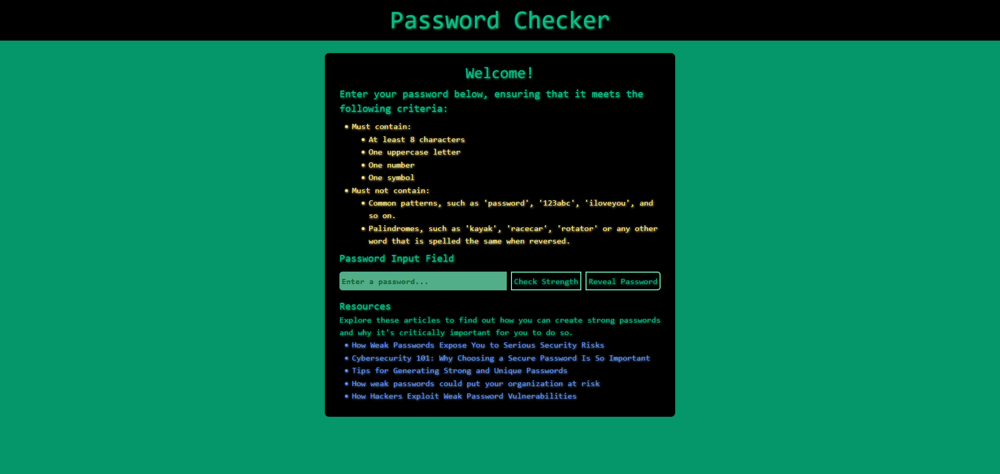
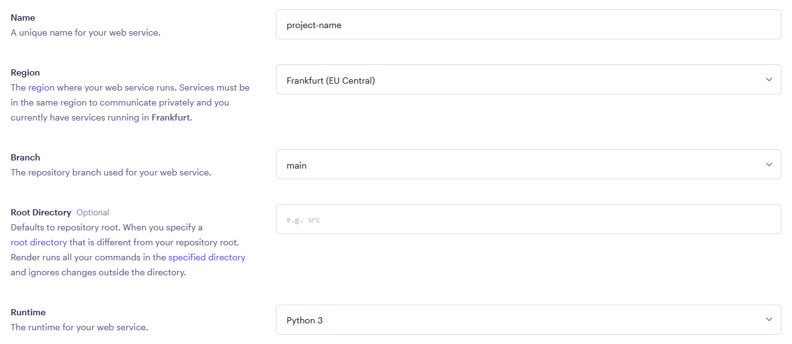
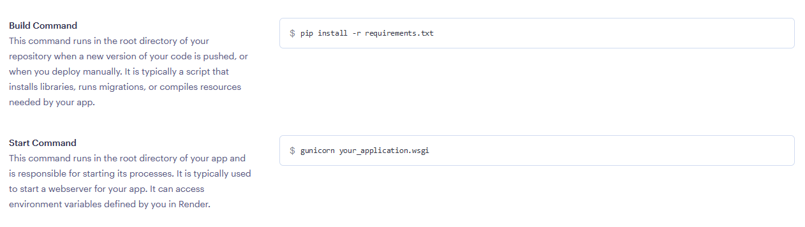
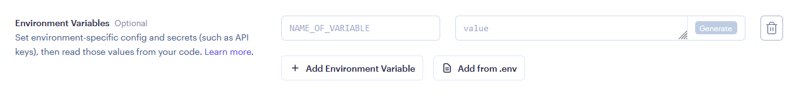
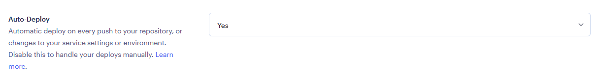
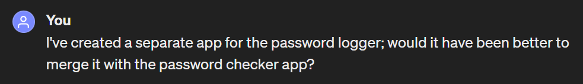
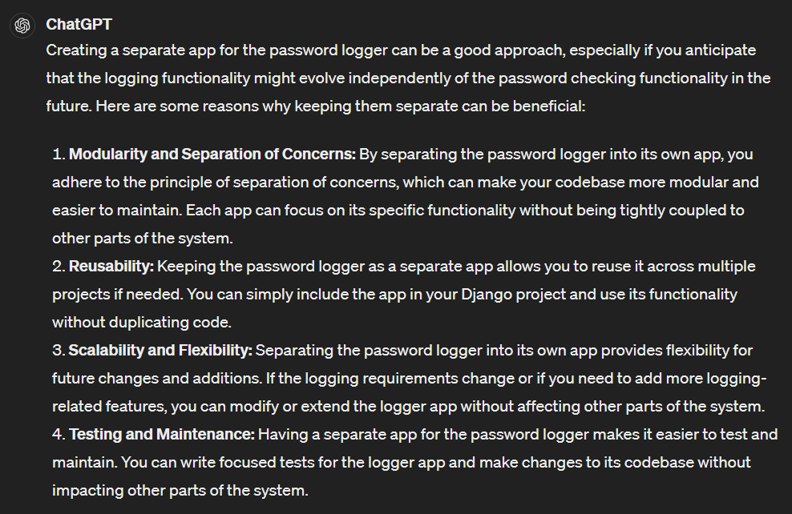
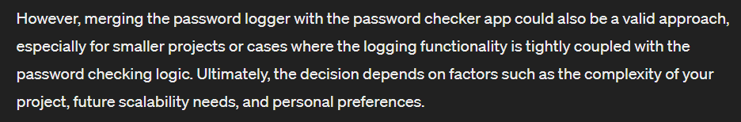

# Password Checker

Nowadays, password hacking is commonplace - which is not surprising at all. According to a recent study, 75% of people don't adhere to password best practices. That means roughly 3 out of 4 people are at risk of having their online accounts compromised.

As part of the study, participants were asked why they hadn't taken note of prior warnings, and it was discovered that more than a third of them felt overwhelmed by the prospect of changing their habits. In light of these findings, it seemed to me that a simple solution was needed. Enter, Password Checker.

Essentially, it walks users through the process of creating secure passwords. Its accompanying User Interface (UI) isn't fancy, and it was designed without the assumption that its users are tech saavy individuals. It just gets straight to the point, as it should.



\* _**Note**: screen responsiveness has not been considered for this project, as it was not an explicit requirement, nor was the development of a UI. However, I chose to create a UI to enhance user interaction._

## How to Use

First, users are asked to take note of the criteria. They can then begin entering their password, choosing to toggle its visibility by clicking the 'Reveal/Hide Password' button. Once they've input their password, they can click the 'Check Strength' button to determine its strength; they will receive immediate feedback. Depending on whether or not their password meets the specified criteria, they will be informed that their password is either weak, medium or strong. Once they've created a suitable password, they can explore resources which will help them to understand the critical importance of creating secure passwords.

## Features

### Current Features

- First and foremost, it was decided that a UI was needed in order to convey the message in a way that would be appealing to users.

  - Moderately bright color tones have been used - not too bright and not too dark. Black has also been utilised to create contrast and ensure that all text is clear and easy to read. Additionally, a text glow effect has been added for increased readability.
  - Concise instructions have been included, each section has been clearly marked, and a 'Reveal Password' button has been included, all to aid ease of use.

- When the password checker is utilised, user inputs are passed through a series of logical assessments to determine overall strength. First, the program checks to see if the password is less than 8 characters, if it's a palindrome, and if it contains a date; if any of these conditions return True, the password will be classified as weak. From there, it checks for at least one uppercase letter, one digit, and one special character. If all criteria are met, users will be informed that their password is strong. If only two criteria are met, they will be informed that their password is of medium strength. Finally, if only one criterion has been met, they will be informed that their password is weak.

- A resources section has been added to develop the understanding of users. Many people aren't aware that there are risks to be considered, and so they likely wouldn't think to do any research. By drawing their attention to a series of articles, I'm raising awareness and providing them with relevant information.

### Prospective Features

- Additional password checking criteria, such as penalisation of dictionary words and repeated characters
- Entropy-based calculations to measure password strength more accurately

## Data Model

For my data model, I decided it would be best to create a password logging class. The model, named PasswordLogger, serves as a logging system for password attempts. It stores essential information such as the password input, the timestamp of the attempt, and whether or not the attempt was successful.

To enhance usability and readability, a method has been included within the class, which defines how instances of the PasswordLogger model are represented as strings. This method ensures that when instances are displayed, they provide a clear and human-readable representation, conveying both the password and the outcome of user inputs.

Overall, the PasswordLogger class offers a structured approach to logging password attempts and allows for the effective analysis of data.

## Security Considerations

As the nature of this project pertains to bolstering the security habits of users across the internet, securing its assets is a key concern.

### Absence of sensitive files from version control

Certain files (i.e. database and log files) should not be publicly recorded, as they contain sensitive information that could be exploited by malicious actors. It's, therefore, necessary to add them to a `.gitignore` file.

### Secure communication

Ideally, websites should be secured using HTTPS and SSL/TLS protocols. These protocols encrypt data transmitted between the client (browser) and the server, which prevents eavesdropping and so-called man-in-the-middle attacks. Having said that, as this project isn't intended for public use, the necessary certificates have not been set up on my web server.

### Password encryption

Thankfully, Django comes with a built-in `make_password` function that automatically hashes password inputs; it simply needs to be imported from the `hashers` module and (as in this case) incorporated into the relevant view function. This is an imperative feature, as it ensures that passwords aren't stored in plaintext and remain secure in the database.

### CSRF attacks

While users are not required to login and aren't vulnerable to authentication-related CSRF attacks, it is possible for malicious actors to exploit users by making requests to the server without their consent. In doing so, attackers can target specific actions undertaken by the password checking application and add new password checking rules or modify existing logic. For example, they could add a malicious rule that bypasses the evaluation logic and classifies all passwords as '**strong**'. This would severely impact the integrity of the application.

Unfortunately, backend vulnerabilities aren't the only cause for concern, as server-side actions can also be targeted. Actions that accept requests, such as those that modify data, perform calculations, or interact with external systems require protection.

Even if a project doesn't seem to be at immediate risk of compromise, including a CSRF token in HTML forms is considered good practice. Not only does it help to maintain a standard level of security, but it also reduces the risk of overlooked vulnerabilities.

### Additional measures not implemented in this project

Aside from the above, brute force protection, input validation and session management should all be taken into account. Again, as this project isn't intended for widespread use, these features haven't been included. I will keep them in mind for future projects, however, as their inclusion begets the safety of my users.

## Testing

### HTML

- **3 errors were identified**:
  - _'Element ul not allowed as child of element ul in this context. (Suppressing further errors from this subtree.)'_ - **fixed** ✅
  - _'Element ul not allowed as child of element ul in this context. (Suppressing further errors from this subtree.)'_ - **fixed** ✅
  - _'Element style not allowed as child of element div in this context. (Suppressing further errors from this subtree.)'_ - **fixed** ✅

### Python

- Passed through the pycodestyle tool - via command line interface (CLI) - with no significant issues.
- All criteria was rigorously tested to ensure the program functioned as expected.

\* _Testing was carried out in VS Code live server, the Django server within my project directory and also via the live web service deployed on Render._

### JavaScript

- Passed through the Esprima validator with no syntax errors.

### Password test cases

| Weak      | Medium        | Strong                    |
| --------- | ------------- | ------------------------- |
| password  | MyPassword123 | Tr0ub4dor&3               |
| password1 | Abcd1234      | CorrectHorseBatteryStaple |
| 123456    | Hello123world | 5ecureP@ssw0rd!           |
| abcdef    | P@ssw0rd      | F0rTun3&Gl0rY             |
| qwerty    | 1qaz2wsx      | $uperP@ssword!            |
| 111111    | Qazwsx123     | B1gSecret&Dea1            |
| iloveyou  | IamStrong!    | L0ve2H8t3!                |
| letmein   | H@ppyDay99    | 3xTr3m3lySecureP@ss       |
| sunshine  | Th1sIsIt!     | S@f3P@ssw0rd!             |
| princess  | GoodLuck777   | 1nCred!b1eP@ssw0rd        |

\* _**Generated by ChatGPT**_

### Password logging

#### Steps

1. Before doing anything, pending migrations were completed to ensure the database scheme was up-to-date; this was achieved by running the following command from the root directory:

   `python manage.py migrate`

2. Once all pending updates had been migrated, I opened the Django shell by running this command:

   `python manage.py shell`

3. It then came time to interact with the database using the following Object-Relational Mapping (ORM) syntax.

   ```
    # import the PasswordLogger model
    from password_checker.models import PasswordLogger

    # Create a new PasswordLogger instance
    logger = PasswordLogger(password=example_password, success=False)

    # Save the instance to the database
    logger.save()

    # Retrieve the instance from the database
    saved_logger = PasswordLogger.objects.get(pk=logger.pk)

    # Verify that the retrieved instance matches the original input
    print(saved_logger.password)
    print(saved_logger.success)
   ```

   **Results**:

   - example_password ✅
   - False ✅

## Remaining Bugs

- As far as I'm aware, there are no remaining bugs to be found.

## Deployment

This project was deployed using Django, a high-level web framework, and Render, a modern cloud platform for deploying and scaling web applications.

### Steps

#### Part 1: Setting up the Django project directory in VS Code

1. **Install Python**: if Python hasn't already been installed in the development environment, download and install it from the official Python website.

2. **Install Django**: if Django hasn't already been installed, install it via the CLI using the following command:

   `pip install django`

3. **Create a Django project**: navigate to the directory where you'd like to create the Django project and run the following command:

   `django-admin startproject project_name`

   \* _Replace **project_name** with a name of your choice._

4. **Navigate to the project directory**: use the `cd` command to access the directory of the newly created Django project.

   `cd project_name`

5. **Create a Django app**: these are essentially components within a Django project that handle specific functions. In order to create a new app, run the following command:

   `python manage.py startapp app_name`

   \* _Replace **app_name** with the name of your app._

6. **Define URL patterns**: these must be defined in the `urls.py` file - within the app directory - to map URLs to views; this is where you should specify which views are to be called for each constructed URL. Read more about URL patterns [here](https://docs.djangoproject.com/en/5.0/topics/http/urls/).

7. **Define views**: these are Python functions or classes designed to handle requests and return responses. Views should be defined in `views.py` - located within the app directory. Read more about views [here](https://docs.djangoproject.com/en/5.0/topics/http/views/).

8. **Configure settings**: these settings moderate the behaviour of your Django project; database connection, static files, and middleware should all be configured in `settings.py`. Read more about settings [here](https://docs.djangoproject.com/en/5.0/topics/settings/).

9. **Add necessary files**: a number of files are needed for successful deployment, such as a `requirements.txt` file within which dependencies need to be added; a `.gitattributes` file within which attributes can be assigned to pathnames, and so on.

10. When you're ready, start the development server by running the following command:

    `python manage.py runserver`

    The server will then start locally, and you should be be able to access the project in your web browser by navigating to `http://127.0.0.1:8000`.

Once these steps have been completed, the basic project setup is finished. From here, you can add HTML templates for your UI, you can add a `README.md` file to document the development process, and add any other relevant files. It's entirely up to you.

#### Part 2: creating a local GitHub repository clone

1. **Locate the repository**: navigate to the GitHub repository you want to clone

2. **Copy the repository URL**: on the repository page, locate the green **<> Code** button; this will reveal the URL for the repository. Click the clipboard icon to copy the URL.

3. At this stage, you'll need to have Git installed. If it isn't already available in your local environment, and you're using Windows, you can download and install it from the official Git website: [Git for Windows](https://gitforwindows.org/).

   After installing Git, you can verify the installation by running the following command:

   `git --version`

   If it was successful, the Git version should be displayed within the Terminal.

4. Back in VS Code, navigate to the directory within which your project directory; the command should look something like this:

   `cd Desktop/projects`

   \* _**Note:** it's not advised to store it directly within the project directory due to security risks, organisation issues and other potential conflicts._

5. **Clone the repository**: once you've switched into the desired directory, use the `git clone` command followed by the repository URL you copied from GitHub.

   `git clone https://github.com/username/repository.git`

6. **Enter the cloned directory**: after cloning, switch into the newly created directory using the `cd` command.

   `cd repository_name`

7. Environment setup: create files necessary for the project. If Node.js is a required dependency, then you'll want to run `npm install`. In this project, a number of dependencies were required, so it was necessary to run the following command:

   `pip install -r requirements.txt`

   Once the file has been created, you can add all applicable dependencies and their respective versions to the file.

   \* _**Note**: a number of dependencies will be automatically added to the file. Feel free to remove any that aren't needed for your project._

8. When changes are made, a series of Git commands can be used to push them to your repository.

   a. `git add` stages either a single or multiple files
   b. `git commit "Add message here"` saves changes to the local repository
   c. `git push` uploads local repository content to its remote counterpart

   Repeat this step as and when necessary.

   \* _**Note**: it's good practice to perform an initial commit to ensure all the files are present and correct before getting to work._

#### Part 3: deploying via Render

1. Log in to your Render account at [Render.com](https://render.com/)

2. Go to the upper-right corner and click **New +**.

3. When the dropdown list appears, click **Web Service**.

4. From the dropdown list, click 'Connect' next to the GitHub repo within which your code has been stored.

5. Configure the settings.

   
   

   - **Name**: enter your project name (no spaces)
   - **Region**: choose the region where you'd like your web service to run
   - **Branch**: specify the appropriate repository branch (if different from `main`)
   - **Runtime**: select your preferred runtime option. For example: Python 3 - as utilised in this project.
   - **Build Command**: when you selected the runtime, this field should have been populated. For example, you might opt for `pip install -r requirements.txt` - the command chosen for this project.
   - **Start Command**: this command is responsible for starting the app webserver. For example, you might enter `gunicorn your_application.wsgi` - which was used for this project.

   

   - **Environment variables**: if you'd like to bind your service to a specific port, you can enter **PORT** into the variable field and the applicable port number into the value field. Otherwise, you can leave it blank; it will then default to **port 10000** - this is the port utilised in my project.

   

   - **Auto-Deploy**: in the **Advanced** settings section, you can choose whether you'd like to deploy the service automatically; if you choose **Yes**, your service will be redeployed whenever changes are pushed to your Github repository. If you select **No**, you'll have to do it manually by clicking the **Manual Deploy** button in the upper-right corner.

   \* _**Note:** you can change these settings at any time in the 'Settings' section._

Once you've configured the settings, your service is ready for deployment; the process will be initiated automatically if you selected **Yes** in the **Auto-Deploy** option field.

## References

### Acknowledgements

- I would like to thank John - a tutor at Code Institute - for aiding me in solving a deployment problem.

- I would also like to thank Tomi Tokko who partnered with freeCodeCamp to provide comprehensive, backend web development courses on YouTube.

### Code Inspiration

- A project-based [tutorial](https://www.youtube.com/watch?v=ftKiHCDVwfA) from which I extracted knowledge about Tailwind CSS.

- A project-based [tutorial](https://www.youtube.com/watch?v=jBzwzrDvZ18) during which Django implementation is explained in depth.

- ChatGPT has aided me in breaking down and understanding key programming concepts.

  
  
  

  \* _ChatGPT has been instrumental in terms of developing my understanding of Django._

### Media

- An [article](https://www.beckershospitalreview.com/cybersecurity/30-most-common-passwords-of-2023.html) I read in order to determine the most common password patterns.

- An [article](https://www.programiz.com/python-programming/docstrings) which aided me in refreshing my knowledge about Python commenting best practices.

- The CSS Tailwind [cheetsheet](https://nerdcave.com/tailwind-cheat-sheet) that I used to translate my knowledge of classic CSS styling (inline styles and stylesheets).

- These Django docs cover various topics:

  - [Writing your first Django app](https://docs.djangoproject.com/en/5.0/intro/tutorial01/)
  - [URL dispatcher](https://docs.djangoproject.com/en/5.0/topics/http/urls/)
  - [Writing views](https://docs.djangoproject.com/en/5.0/topics/http/views/)
  - [Django settings](https://docs.djangoproject.com/en/5.0/topics/settings/)
  - [Password management](https://docs.djangoproject.com/en/5.0/topics/auth/passwords/)
  - [Making queries](https://docs.djangoproject.com/en/5.0/topics/db/queries/)

- An [article](https://www.geeksforgeeks.org/django-orm-inserting-updating-deleting-data/) which explains the ins and outs of Django's ORM.

- These MDN articles contain key information on Asynchronous JavaScript and XML (AJAX).

  - A series of [articles](https://developer.mozilla.org/en-US/docs/Learn/JavaScript/Asynchronous) that explain Asynchronous JavaScript.

  - A series of [articles](https://developer.mozilla.org/en-US/docs/Learn/JavaScript/Client-side_web_APIs) that explain the process of retrieving data from web servers.

- These articles contain information about CSRF attacks and how to prevent them:

  - [Cross Site Request Forgery (CSRF)](https://owasp.org/www-community/attacks/csrf)
  - [Cross-Site Request Forgery Prevention Cheat Sheet](https://cheatsheetseries.owasp.org/cheatsheets/Cross-Site_Request_Forgery_Prevention_Cheat_Sheet.html)

- A series of [articles](https://docs.oracle.com/en/middleware/goldengate/core/19.1/securing/communications-security.html) that explore the topic of secure communication protocols.

- These are the educational articles I added to my UI:

  - [How Weak Passwords Expose You to Serious Security Risks](https://jetpack.com/blog/weak-passwords/#:~:text=Weak%20passwords%20can%20lead%20to,immediate%20and%20devastating%20financial%20implications.)
  - [Cybersecurity 101: Why Choosing a Secure Password Is So Important](https://www.waldenu.edu/programs/information-technology/resource/cybersecurity-101-why-choosing-a-secure-password-in-so-important)
  - [Tips for Generating Strong and Unique Passwords](https://www.kaspersky.com/resource-center/threats/how-to-create-a-strong-password)
  - [How weak passwords could put your organization at risk](https://www.techrepublic.com/article/how-weak-passwords-could-put-your-organization-at-risk/)
  - [How Hackers Exploit Weak Password Vulnerabilities](https://www.nopsec.com/blog/weak-passwords-exploit/)

- Reading this [article](https://www.securitymagazine.com/articles/99529-3-in-4-people-at-risk-of-being-hacked-due-to-poor-password-practices) aided me in understanding hacking statistics and risks
